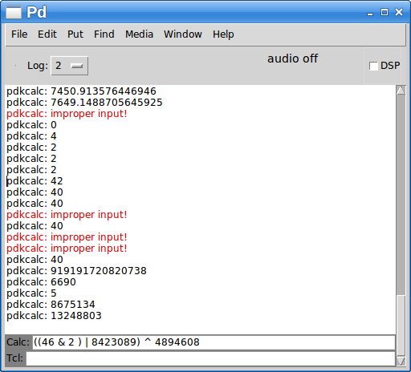

# pdk-guiplugins
pure data gui plugins (threadbare for now, mostly for personal use)

pdkcalc-plugin.tcl - calculator for the Pd window (code mostly lifted from the commonly availble Tcl prompt plugin)
pdktheme-plugin.tcl - minimal theming for less eyebleed

